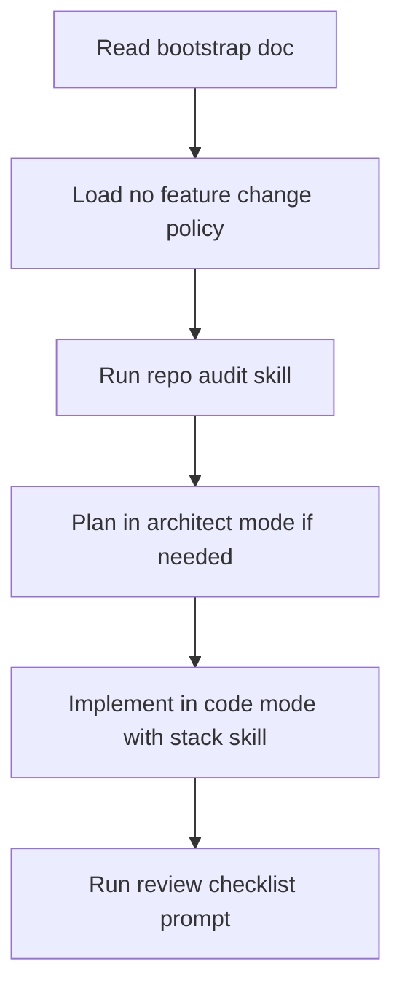

# AI Workflow Overview

This repository has integrated a **super-roo style workflow** centered on [`.roo/README.md`](../../.roo/README.md) and indexed in [`AGENTS.md`](../../AGENTS.md).

## What was integrated

- Mode playbooks in [`.roo/modes`](../../.roo/modes)
- Reusable safety skills in [`.roo/skills`](../../.roo/skills)
- Guardrail prompts in [`.roo/prompts`](../../.roo/prompts)
- Cross-reference index in [`AGENTS.md`](../../AGENTS.md)

## Start here

1. Read [`docs/ai-workflow/bootstrap.md`](./bootstrap.md)
2. Confirm default policy in [`docs/ai-workflow/no-feature-change-policy.md`](./no-feature-change-policy.md)
3. Pick a mode using [`docs/ai-workflow/modes.md`](./modes.md)
4. Apply a skill from [`docs/ai-workflow/skills.md`](./skills.md)
5. Finish with prompt checks in [`docs/ai-workflow/prompts.md`](./prompts.md)

## Repo risk surfaces to keep stable

- UI routes and load actions: [`src/routes`](../../src/routes)
- Frontend API contracts: [`src/lib/api`](../../src/lib/api)
- Backend HTTP handlers: [`src-tauri/src/http`](../../src-tauri/src/http)
- Backend services: [`src-tauri/src/services`](../../src-tauri/src/services)
- Backend models: [`src-tauri/src/models`](../../src-tauri/src/models)
- DB schema and rollbacks: [`src-tauri/migrations`](../../src-tauri/migrations)

## Practical adoption flow

Use this overview as the entrypoint, then execute the concise checklists in each companion page.